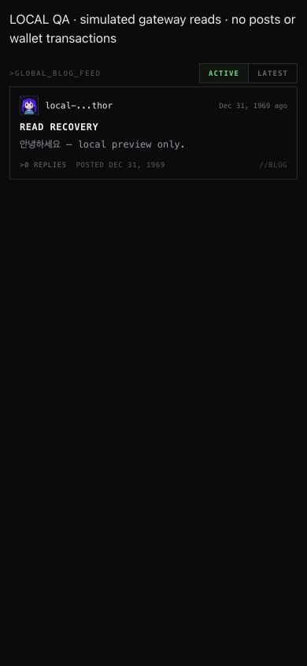
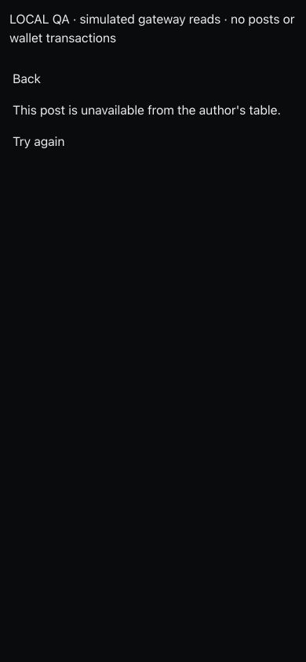

# Blog read recovery

Local verification, 2026-09-16. Production BlogFeed/BlogPostView components; screenshots use explicitly simulated gateway responses. No wallet, inscription or public post was submitted.

- Shared reader tests cover out-of-order feed sorts, obsolete errors, independent post reads, failed-read retry, and invalidation of old comments after a successful write.
- React tests cover unavailable author-table bodies (never substitute the feed preview), failed-feed retry, and preserving Korean drafts/cached comments during read failure.
- Browser: the failure state has Retry; clicking it restores the Korean preview; opening a missing author-table post shows an unavailable state with Back/Retry.
- Confirmed comment writes remain successful when only their follow-up read fails. The error belongs to the comments read, so users are not prompted to submit duplicate comments.

Validation: all 480 core tests passed on rerun, all 7 webview tests passed, production build passed. Initial full-core run hit the existing session-settings test's fixed-delay timing race and cleanup rejection; both logs are retained. Typecheck reports the same ten baseline unused-symbol errors. This patch does not fix the independent session-history race or all issue #208 media-cluster paths.

